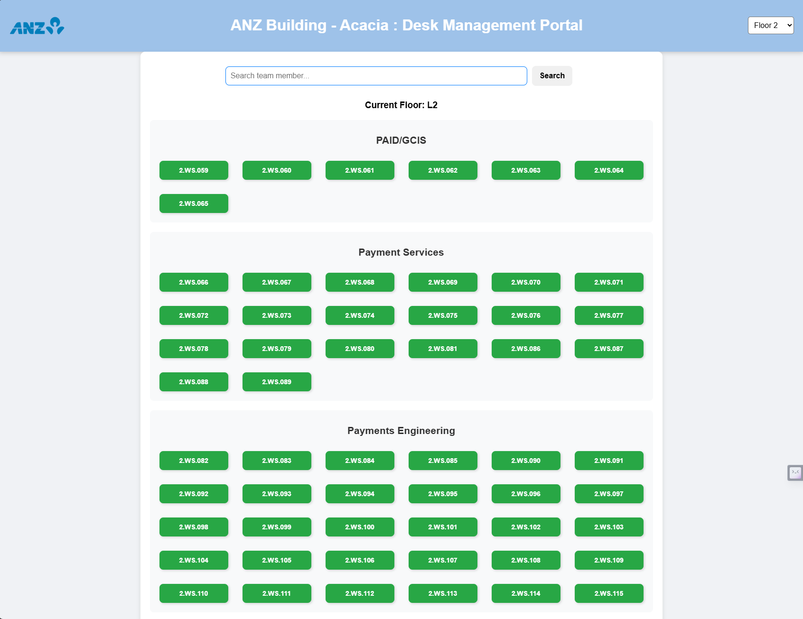

# 🏢 Office Desk Management Portal (ANZ Acacia)  

### **🌟 Project Overview**
The **Office Desk Management Portal** is a real-time desk availability system that helps employees manage and locate available desks efficiently. It provides a simple UI where:
- Employees can **reserve desks** by clicking on them.
- Clicking a **red desk releases it** back to available mode.
- Users can **search for colleagues** and automatically scroll to their occupied desk.
- Supports **multi-floor selection**, making it adaptable for large offices.

---

## **📷 UI Overview**



---

## **🎥 Features & Functionality**
### **1️⃣ Desk Availability & Selection**  
- Users can click on a **green (available)** desk to **occupy it**, turning it **red**.
- Users can click on a **red (occupied)** desk to **release it**, turning it **green**.
  
🎥 **Demo: Selecting a Desk & Occupying It**  

  

---

### **2️⃣ Real-time Search for Employees**  
- Type **at least 3-4 characters** of a person's name.
- The system will **auto-scroll to their desk and highlight it** if they are present.
- If the person is **not found**, an error message appears for **2 seconds**.

🎥 **Demo: Searching for a Colleague's Desk**  

  

---

### **3️⃣ Floor Selection & Multi-Floor Management**  
- Users can **switch between floors** via the dropdown (`L1` to `L18`).
- Each floor has a **separate desk layout** stored in the backend.

🎥 **Demo: Multi-Floor Desk Layout**  


---

### **4️⃣ Back to Top Button**
- A **floating "Back to Top" button** appears when scrolling.
- Clicking it instantly **scrolls to the search bar**.

---

## **🛠️ Current Working Features**
✔️ **Real-time desk availability** (click to occupy/release).  
✔️ **Multi-floor support** (L2 - L18, JSON-based).  
✔️ **Search by name (3-4 character matching, auto-scroll & highlight).**  
✔️ **Real-time updates without refreshing the page.**  
✔️ **Back to Top button for easy navigation.**  
✔️ **Auto-reset desks to "available" at 6 PM IST every day.**  

---

## **🚀 Next Phase (Planned Enhancements)**
🔹 **Improved UI Styling** (modern animations, smooth transitions).  
🔹 **Mobile Responsiveness** (optimize for mobile users).  
🔹 **Admin Panel** (manually override desk status, bulk updates).  
🔹 **Analytics Dashboard** (desk usage patterns, peak occupancy).  
🔹 **User Authentication (Optional)** (to avoid misuse).  

---

## **🎯 Project Motivation**
This project was designed to **simplify desk booking in a hybrid work environment**. Many offices have **hot-desking** policies, where desks are unassigned, making it difficult for employees to:
1. **Find an available desk.**
2. **Locate teammates easily.**
3. **Reduce time wasted in searching.**  

This system **eliminates confusion** and makes office seating **efficient & transparent**.

---

## **📦 Installation & Setup**
### **1️⃣ Backend (Flask)**
```sh
cd backend
pip install -r requirements.txt
python app.py
```

Runs the **Flask API** for desk data.

### **2️⃣ Frontend (React)**
```sh
cd frontend
npm install
npm start
```

Runs the **React UI** for desk selection.

* * * * *

**📜 License**
--------------

This project is **open-source** and can be modified for internal office use.

👨‍💻 **Designed & Developed by:**\
📌 **Debarun Ghosh (PRESS - Apprentice, ANZ Acacia)**

